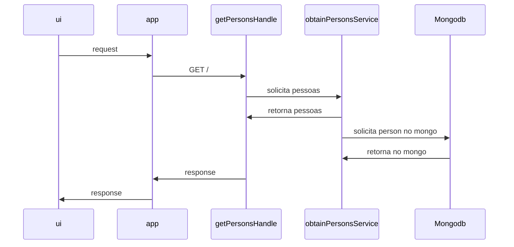

# Golang 

```mermaid 
sequenceDiagram
ui->>app: request
app->>getPersonsHandle: GET /
getPersonsHandle->>obtainPersonsService: solicita pessoas
obtainPersonsService->>getPersonsHandle: retorna pessoas
obtainPersonsService->>Mongodb: solicita person no mongo
Mongodb->>obtainPersonsService: retorna no mongo
getPersonsHandle->>app: response
app->>ui: response
```