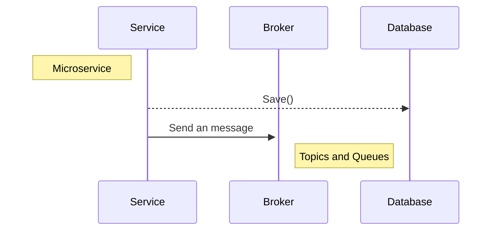
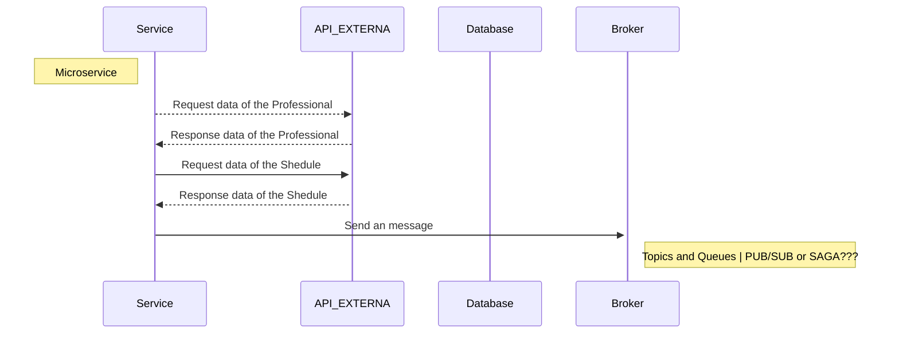

# Qbem Architecture with Golang | Sample

This is an simples sample

## TODO's

- [ ] Template de doc
  - [ ] API
  - [ ] Queue/Kafka/NatsIO ...N
  - [ ] Docker
  - [ ] Docker Compose
  - [ ] CI/CD Drone yml
  - [ ] Plugins VScode
  - [ ] Deploy
- [ ] Arch
  - [ ] API
  - [ ] Professional
    - [ ] Entities
      - [ ] main.go 
      - [ ] main_test.go 
    - [ ] Repos
      - [ ] ProfessionalRepo
    - [ ] UseCases
  - [ ] Schedules
    - [ ] Entities
    - [ ] Repos
    - [ ] UseCases
- [ ] Sandbox to Front End | Camilo
- [ ] Broadcast | ???

## TODO: Visão geral do micro serviço

## TODO: Service

## Reference
