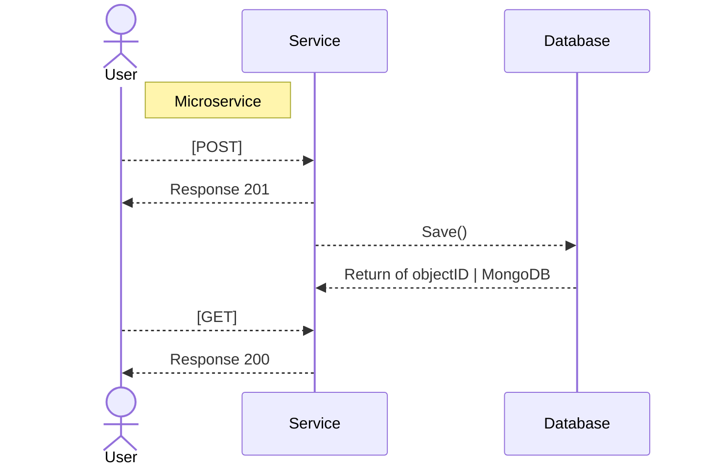

# API

## Routes
```go
func main() {
    r := mux.NewRouter()
    r.HandleFunc("/heathcheck", HeathCheck)
    r.HandleFunc("/your-service", HeathCheck).Methods(http.MethodGET)
    r.HandleFunc("/your-service", HeathCheck).Methods(http.MethodPOST)
}
```

## API Diagram

Visão de como os services se comunicam internamente.

